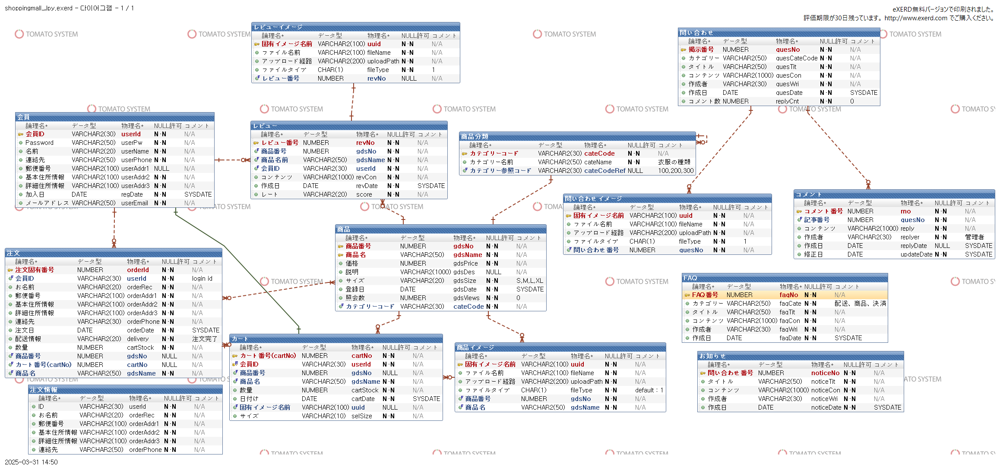

<h2 align="left">🛒 GUCI ショッピングモール プロジェクト</h2>

<blockquote>
初めてチームで取り組んだプロジェクトであり、多くの学びと成長が得られました。
</blockquote>

<blockquote>
チームで初めて取り組んだWebショッピングモールのプロジェクトです。
Javaをベースにしたバックエンドと、HTML/CSS/JavaScript/JSP/JQueryを使ったフロントエンドで構成されたチーム型Web開発プロジェクトです。
</blockquote>

<h2 align="left">🛠 使用技術(Tech Stack) </h2>
<li> Java8 </li>
<li> Oracle Database </li>
<li> HTML / CSS / JavaScript </li>
<li> JQuery/ Bootstrap3.3.7 + 4 / JSP / Servlet </li>
<li> Spring Framework5 / Spring Security </li>
<li> Apache Tomcat 9.0 </li>
<li> JavaMailSender / HtmlEmail / BCryptPasswordEncoder(認証,暗号化)</li>

<h2 align="left">🗂 機能一覧（Main Features）</h2> 
<li> ユーザー登録・ログイン機能　</li>
<li> 商品一覧・詳細表示 </li>
<li> カート・購入処理 </li>
<li> お気に入り（찜하기）管理機能 </li>
<li> レビュー・Q&A登録機能 </li>
<li> 管理者ページ（商品登録・修正・削除）</li>

<h3>🖼 ER図</h3>

  

<h2 align="left"> 👥 チーム構成（Team）</h2>
<li> イ ジンヒョン (チームリーダー) : デザイン, データベース, FAQ/商品/アドミン ページ </li>
<li> グォン セッビョル(チーム員) : お問い合わせ, カート/購買ページ </li>
<li> シン ヨンリョル(チーム員) : デザイン,データベース,お問い合わせ, 会員ページ </li>
<li> イ フェイエ(チーム員) : レビュー, カート/購買ページ </li>
<li> イム チャンヒョク(チーム員) : お知らせ, 会員ページ、ログインロジック作成 </li>

<h2 aligh="left"><strong>🧠 学び・成果（What I Learned）</strong></h2>
<li><strong>実際のチーム開発での役割分担や責任感を経験</strong></li>
<li><strong>ER図とテーブル構造の理解がプロジェクト成功に不可欠だと実感</strong></li>
<li><strong>JavaとSQLの連携についての理解が深まった</strong></li>

<h2 aligh="left"> 📎 その他（Others）</h2>
<li> チーム開発期間: 2021年1月 ～ 2021年2月</li>
<li> 提出目的: 日本企業へのポートフォリオ用</li>
<li>限られた時間内では、機能の開発が最優先であったため、一部のパスや設定はハードコーディングされています。</li>
<li>実際のサービス環境では、<code>application.properties</code>などの外部設定を利用し、柔軟なパスおよびファイル管理が必要であることを認識しております。</li>

<h2 aligh="left">✍️ 使用ライブラリについて（使用JAR）</h2>

本プロジェクトでは Oracle データベースとの接続のため、`lib/ojdbc6_g.jar` をプロジェクト内に直接含めています。  
Maven や Gradle などの依存関係管理ツールを使用しない環境でも、動作確認を容易に行えるようにするための対応です。

そのため、初回起動時は追加設定なしで JDBC ドライバが認識され、すぐに動作確認が可能です。

※ 当プロジェクトに使われているojdbc6_g.jarファイルは
  <strong>others/ojdbc6_g.jar</strong>に格納されています。

✅ メール認証機能

<li> JavaMailSenderを使用し、6桁の認証コードを生成・送信</li>
<li> MimeMessageHelperでHTML形式のメールを送信</li>

 🔐 仮パスワード再設定

<li> ランダムな12文字の仮パスワードを生成</li>
<li> HtmlEmailで送信後、BCryptPasswordEncoderで暗号化してDBに保存</li>
<li> Spring Security の BCryptPasswordEncoder によってパスワードを安全に暗号化しました。</li>

<h2 aligh="left"><strong> 🙇‍♂️ 作業を通じての気づきと感想</strong></h2>

このプロジェクトのコード整備・日本語コメント追加は、単なる形式的な作業ではなく、全体の構造とロジックを自分自身の言葉で再確認するプロセスでした。
特に移動中にもERDの整合性を確認しながら作業を進めたことは、限られた時間を最大限に活かす自分なりの努力でした。

今後、さらに多言語対応やテストコードの追加など、機能拡張を通してより完成度を高めていく予定です。

